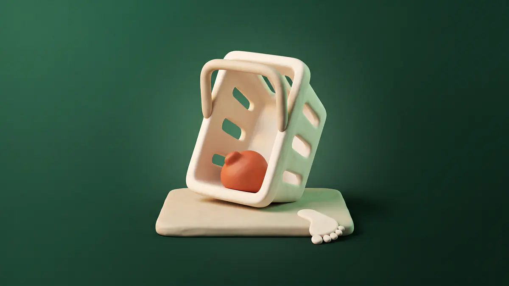

  

# Abandoned Baskets for Shop

Shows you the baskets nobody finished, and what the shopper had typed into the checkout before they went.

Every unfinished basket lands on a tab in **Trading**, with what was in it, roughly what it was worth, and whatever they got as far as filling in: name, email, phone, delivery address, discount code, chosen payment method. Optional reminder emails go to the ones who left an address.

The whole thing waits on your cookie banner. No agreement, nothing recorded.

## What it does

- **Baskets and started checkouts, in one list.** Filter between "basket only", "checkout started" and "came back", or read the lot.
- **Everything they typed.** Whatever was in the checkout boxes when they stopped, kept through a shopper who wanders back to the basket page and loses the form.
- **Marks its own successes.** A basket that turns into an order is closed and stamped with the order number, so the list tells you how many came back rather than only how many left.
- **Optional reminders.** Off by default. On a delay you choose, at most three per basket, never to somebody who has since ordered, never again to somebody who has asked you to stop. Wording lives in **Settings › Emails** with every other email on the site.
- **Deletes itself on a schedule.** Baskets older than your retention setting go, whether they were reminded, recovered or neither.

## Consent

This module records a name, an address and a phone number belonging to somebody who never placed an order, so it does not record anything until it is allowed to.

- It asks your site to carry the standard **Marketing** category, offered as a one-click suggestion on the Privacy tab.
- Nothing is written - no cookie, no basket, no typed details - until a shopper grants that category. Not answering the banner counts as not granting it.
- A shopper who withdraws consent has everything of theirs deleted, and the cookie identifying their browser cleared, on the spot.
- The gate is enforced twice: in the browser, and again on the server, where a hand-written request cannot slip past it.
- If your banner is switched off, or carries no Marketing category, there is nothing for anybody to agree to and capture runs for everyone. The settings panel says so, loudly, because it is your decision to make and your exposure if you make it carelessly.
- Every reminder email carries a working unsubscribe, and the suppression outlives the basket it came from.
- A signed-in member's unfinished baskets are included in their own data export.

## Requirements

- Cactus core **0.5.1234** or newer
- The **Shop** module, **0.1.300** or newer
- An email provider configured, if you want the reminders

## How it captures

Installing the module drops an invisible **Abandoned basket tracker** block onto your header layout. It draws nothing; it watches the basket and the checkout boxes and reports them. If you ever delete it, capture stops - put it back from the block list on any header or footer layout.

The shop's basket lives in the browser until an order is placed, so this is the only place there is to watch it from. The module asks nothing of the Shop module itself: a site running the shop without this installed is byte-for-byte the shop it was.

## Settings

**Settings › Shop › Abandoned baskets.**

| Setting | Default | What it does |
| --- | --- | --- |
| Keep unfinished baskets | On | The master switch. Off means nothing is recorded and no reminders go out. |
| Include baskets that never reached the checkout | On | Off keeps only the ones where somebody started filling the checkout in. |
| Counts as abandoned after | 60 minutes | Drives the "Abandoned" badge and the earliest a reminder may go. |
| Delete baskets after | 90 days | Retention. Enforced by the hourly job, not by good intentions. |
| Email a reminder | Off | The reminders, and nothing sends while this is off. |
| Wait before the reminder | 240 minutes | Since they last touched the basket. |
| Reminders per basket | 1 | At most three. One is a favour, three is a habit. |

## Permissions

- `abandonedcarts.access` - see the list
- `abandonedcarts.manage` - change the settings, delete a basket

Shop's own permissions deliberately do not grant either. Whoever may edit the catalogue is not automatically somebody who should be reading every shopper's address.

## Tables

`abc_carts`, `abc_suppressions`, `abc_settings`. All declared for teardown, so uninstalling with data removal leaves nothing behind.

## Licence

MIT.
